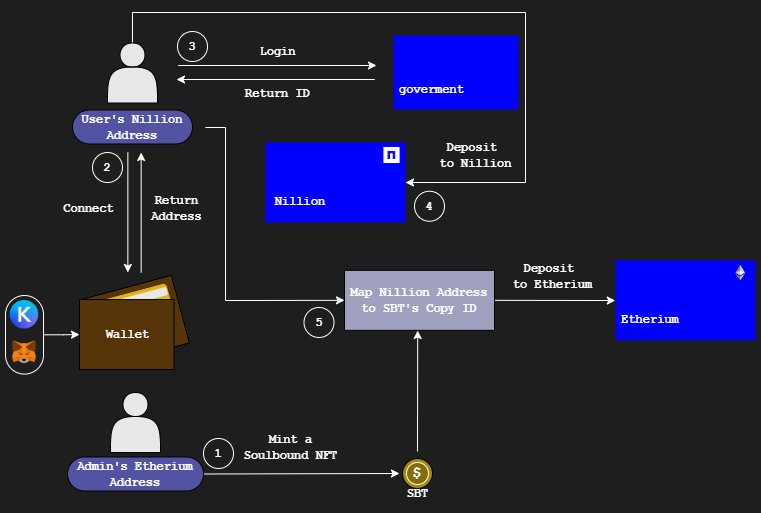

<div align="justify">
  
## Application Overview

The goal of this project is to create the decentralized digital identiy of a user. To do so two different blockchain networks are utilized. The first one is __Nillion__ network, an upcoming network specialized in decentralized data storing. The second one is the __Ethereum__ network, a pioneer netwrok best known for its transaction capabilities.
<br><br>
But first let's talk about what is a decentralized digital identity. Decentralized identity is a type of identity management that allows people to control their own digital identity without depending on a specific service provider or on centralized authorities like goverements, financial institutions etc. Instead of being stored into a centralized database owned by a service provider the identity information is distributed across a blockchain or a decentralized network. Basically, the identity credential belongs solely to the network user rather than the provider. Decentralized identity offers a vast amount of advantages starting with data ownership. Users own their identity and are able to manage it themselfs rather than relying on third parties. Security is enhanced due to the distribtuion of data to multiple blocks  while cryptographic verification ensures authenticity. Privacy is also enhanced by sharing only the necessary information when needed. In addition, it poses a counterpart to censorship, as no single authority can revoke or manipulate any identity.
<br><br>
So, the aim is to create the decentralized idenity of a user by uploading their original identity card to a blockchain network. There are two main issues that need to be taken into account for this action. The first one is authenticity of the uploaded data, i.e., the user should be able to upload only valid credentials, which basically means data taken from a credible source. This workflow demands the integration with the corresponding authorities, which is for now omitted making the assumption that the credential uploaded by a user is valid and authentic. The second one is the validation of the uploading process and the publicize of that event to the community. This basically means that a user that has uploaded their identity to the network is now a certified citizen (i.e. not a scammer). Every user that uploads their identity is rewarded with a soulbound non-fungible token (SBT) which represents the action of uploading the identity credential. Owning the corresponding SBT means that the user has completed the uploading process of their identity card and now is able to take delight of some privileges.

## Used Technologies

There is a bunch of different technologies utilized when it comes to frontend and backend development, smart contracts and blockchain networks.
<br><br>
<ins>Frontent</ins>:
- React.js

<ins>Backend</ins>:
- Python (Fast API)

<ins>Smart Contracts</ins>:
- Solidity

<ins>Blockchain Networks</ins>:
- Nillion
- Etherium

## Blockchain Networks

__Nillion__ 
<br><br>
Nillion is a decentralized network designed for secure, private, and high-speed data processing without relying on blockchain consensus. Nillion introduces a groundbreaking innovation in secure data computation and storage through its Secret Vault technology. It introduces blind computation encryption, in cotrnast to traditional blockcahin networks, enabling parties to perform computations on encrypted data without decrypting it, i.e., without exposing it, enhancing privacy and security. This innovative encryption method is crucial for sensitive applications like financial transactions, healthcare data, and AI model training. At the heart of this innovation is the Nil Message Compute (NMC) technology, which allows for fast, trustless, and scalable multi-party computation (MPC) reducing reliance on centralized entities while enabling privacy preserving data collaboration across industries. The Secret Vault acts as a next-generation security layer, allowing users to store and process highly sensitive information without any point of failure. This decentralized approach eliminates vulnerabilities associated with centralized cloud storage and traditional multi-party computation (MPC) systems, making it a game-changer in privacy-preserving security. The network’s potential spans Web3, cybersecurity, and confidential cloud computing, making it a significant breakthrough in decentralized data infrastructure. 
<br><br>
__Etherium__ 
<br><br>
Ethereum stands as a pioneering blockchain network that revolutionized the concept of decentralized applications (dApps) and smart contracts. Its innovation lies in the ability to execute automated, self-executing contracts without intermediaries, ensuring trustless transactions and reducing operational friction. Ethereum supports a wide range of use cases, from decentralized finance (DeFi) and NFTs to decentralized autonomous organizations (DAOs), making it a backbone for the Web3 movement. One of Ethereum’s advantages is its decentralization, which ensures greater security, transparency, and censorship resistance. With the transition to Proof-of-Stake (PoS), Ethereum has enhanced its scalability and energy efficiency. Ethereum has the ability to facilitate peer-to-peer transactions without the need for trusted third parties democratizes access to financial services and data ownership globally, providing a foundation for financial inclusion.

## Importance of Using Different Blockchain Networks

Nillion network is used for data storing due to the innovation it introduces in computation of encrypted data as mentioned above. But it ain't EVM compatible, thus, not enabling neither smart contracts deployment nor token handling. However, it is integrated with other blockchain network such as Abrtitrum and Etherium as its architecture schema reveals (https://docs.nillion.com/learn/architecture). That's where the Etherium is used, a network specialized on dapps (decentralized applications) development. Smart contracts written in solidity are deployed to create an original SBT and map the Nillion address of a user to the TokenID of a orignal SBT's replica in Ehtereum Network.

## Application's Workflow

The workflow of this application is depicted below.
<br><br> 

<br><br>
Let's break it down real quick. First of all as it metnioned above a user is rewarded with a SBT when uploading their identity to Nillion. But the SBT doesn't belong to the user and cannot be created to Nillion. It belongs to a rewarding system (let's call it the admin) which is responsilbe for minting the original SBT and reproduce copies of it to assign them to users accomplishing the task of uploading their idenity. So, the first step is to mint the original SBT, a task implemented by the admin. For this process the admin must own an address in Ehtereum network (Metamask wallet is utilized). The second step is implemented by a casual user by connecting to Nillion network using their own wallet (Keplr wallet is utilized). The third action refers to loging in to the corresponding authorities for feeding the appropriate credentials to Nillion. At this moment the integration with the corresponding authorities is not feasible, thus, this step includes the uploading of the corresponding credential by the user theirselfs. The fourth step is the deposition of the identity to Nillion network, which is implemented simultaneously with the fifth step, i.e., the mapping of Nillion address to the TokenID of a original's SBT replica. The minting of the SBT's replica underlies the assigning of the token to the user who succesfully completes the task. During this process an internal check is implemented. Basically, if found that an existing Nillion address is already mapped into a TokenID in Ethereum then the uploading process is terminated and prohibbited indicating that the credentials are already uploaded in the system, thus, disabling the user to upload multiple identities and claim multiple tokens. Note that during this procedure the user only needs access to Nillion network while the admin to Ehterium.

## Application's Value

Goal of the application is the creation of the decentralized digital identity of a user by integrating the corresponding topical authorities for authenticity verification of uploaded credentials. In addition, it rewards the user with a SBT converting them to a certified citizen. Basically, claiming the SBT ensures the community that the user is credible. Their association with the SBT indicates the completion of the identity's uploading process. The SBT hoder has now gained a reputation for being a certfied citizen (not being a scammer) enabling them to take part in events. Such events coulbe be digital voting, elections, decentralized finance (DeFi) etc. where the certification of a user should be more than requisite in order to take part. This application is the first step of building an entire decentralized digital wallet and assigning something like a reputation to the user. Future expantions might introduce a reputation system for a user by monitoring statistics for their trasnactions, such as number of transaction, fees payed etc. statistics that can be used for DeFi dapps.  
</div>

# Application's Backend

For dependencies, navigate to your project folder, and create a virtual environment:
```sh
python -m venv <VENV_NAME>
<VENV_NAME>\Scripts\activate.bat
```
Then run:
```sh
pip install -r requirements.txt
```
